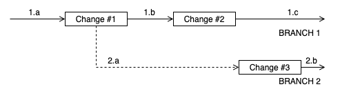

= Chronicle Release Notes

image:https://maven-badges.herokuapp.com/maven-central/net.openhft/chronicle-release-notes-connector-api/badge.svg[link="https://maven-badges.herokuapp.com/maven-central/net.openhft/chronicle-release-notes-connector-api"]

Chronicle Release Notes is a library and CLI utility designed to automate the generation of release notes for GitHub repositories.

== Motivation

Chronicle Release Notes was developed to mitigate the shortcomings of link:https://www.npmjs.com/package/gren-release-notes[gren] when working in a branched out multi-release environment.

The scenario depicted in the diagram above is quite difficult to handle using gren due to GitHub issues being branch-agnostic.

We're going to assume that each change depicted in the diagram above is associated with an issue. Once a release is performed, all issues closed between the last release, and the current one should be included in the release notes for our new release.

As an example, lets say that after making _Change #1_ we've release version 1.0.0 and after _Change #2_ we've release version 1.1.0. Any issues that were closed before the 1.0.0 release should be included in the release notes for 1.0.0.

Similarly, any issues that were closed before the 1.1.0 release should be included in the release notes for 1.1.0, but only the issues that were closed after the 1.0.0 release.

This is possible to do with gren quite easily, however let's take a look at an example where we have to branch out from our main release branch.

Let's say after we've released version 1.1.0, we need to make additional changes to version 1.0.0. To do that, we would create a branch from the 1.0.0 release and make our changes there. These additional changes are represented by _Change #3_ in the diagram above and were chronologically made after _Change #2_.

If we were to release version 1.0.1 after making _Change #3_ and generate release notes using gren, the release notes would include all issues closed between versions 1.0.0 and 1.0.1. However, due to GitHub issues being branch-agnostic, the release notes would also include all issues created between 1.0.0 and 1.1.0 because of the overlapping timelines.

== Installation Requirements

Before using the Chronicle Release Notes, make sure you have the following installed on your system:

- link:https://www.oracle.com/java/technologies/javase/javase-jdk8-downloads.html[Java 8]
- link:https://maven.apache.org/[Maven]/link:https://gradle.org/[Gradle]

== Installation

Maven:

[source,xml]
----
<dependencies>
    ...
    <dependency>
        <groupId>net.openhft</groupId>
        <artifactId>chronicle-release-notes-connector-all</artifactId>
        <version>${chronicle-release-notes.version}</version>
    </dependency>
    ...
</dependencies>
----

Gradle:

[source,groovy]
----
dependencies {
    ...
    implementation "net.openhft:chronicle-release-notes-connector-all:${chronicle-release-notes.version}"
    ...
}
----

== Connecting to GitHub

Before a release can be created, we must first gain access to GitHub's API. That can be done using the following code:

[source,java]
----
final ConnectorProvider<ReleaseConnector> releaseConnectorProvider = ConnectorProviderFactory.getInstance()
    .getReleaseConnectorProvider(ConnectorProviderKeys.GITHUB)
    .orElseThrow(() -> new RuntimeException("Failed to find GitHub release provider"));

final ReleaseConnector releaseConnector = releaseConnectorProvider.connect("YOUR_PERSONAL_ACCESS_TOKEN")
    .orElseThrow(() -> new RuntimeException("Failed to connect to GitHub"));
----

== Creating a release

With Chronicle Release Notes, users are able to create releases from 2 sources - branches and milestones:

=== Creating a release from a branch source

[source,java]
----
final ReleaseResult releaseResult = releaseConnector.createReleaseFromBranch("owner/repository", "1.0.0", "master");

releaseResult.throwIfFail();
----

If release notes are created from a branch source, all issues that should be included in the generated release notes must be referenced through commit messages. For example:

----
Commit message

Closes #1
----

If this commit was made between the last release and the current one, then the issue with id 1 will be included in the generated release notes.

=== Creating a release from a milestone source

[source,java]
----
final ReleaseResult = releaseConnector.createReleaseFromMilestone("owner/respository", "1.0.0", "milestone1");

releaseResult.throwIfFail();
----

If release notes are created from a milestone source, all issues that should be included in the generated release notes must be included in the referenced milestone.

== Additional release options

When generating release notes, we're able to customize the generation process in a couple of ways with various options.

For branch releases, we have the following options:

[source, java]
----
/**
* Ignores all issues that have any of the specified labels
*/
ignoreLabels(String... labels)

/**
* If true, then a release is overriden if it already exists. Otherwise, an exception is thrown.
*/
overrideRelease(boolean overrideRelease)

/**
* If true, then any referenced issue will be included in the generated release notes. Otherwise, an issue reference needs to be preceeded by a closing keyword.
*/
includeIssuesWithoutClosingKeyword(boolean include)
----

These options can be modified via `BranchReleaseOptions::Builder`:

[source, java]
----
final BranchReleaseOptions releaseOptions = new BranchReleaseOptions.Builder()
    .ignoreLabels("wontfix")
    .overrideRelease(true)
    .includeIssuesWithoutClosingKeyword(true)
    .build();

final ReleaseResult releaseResult = releaseConnector.createReleaseFromBranch("owner/repository", "1.0.0", "master", releaseOptions);

releaseResult.throwIfFail();
----

For milestone releases, we have the following options:

[source, java]
----
/**
* Ignores all issues that have any of the specified labels
*/
ignoreLabels(String... labels)

/**
* If true, then a release is overriden if it already exists. Otherwise, an exception is thrown.
*/
overrideRelease(boolean overrideRelease)
----

These options can be modified via `MilestoneReleaseOptions::Builder`:

[source, java]
----
final MilestoneReleaseOptions releaseOptions = new MilestoneReleaseOptions.Builder()
    .ignoreLabels("wontfix")
    .overrideRelease(true)
    .build();

final ReleaseResult releaseResult = releaseConnector.createReleaseFromMilestone("owner/repository", "1.0.0", "milestone1", releaseOptions);

releaseResult.throwIfFail();
----

== Providing additional context

Sometimes an issue name might not be descriptive enough to provide enough context to the user reading the release notes. When creating a release, users are able to append additional information to specific issues in form of comments.

To add more information to a specific issue, add a comment to the specific issue in the following format:

[source, markdown]
----
#comment A comment that provides additional information to the user
----

Users may write multiple comments of this format, but only the latest comment will be included in the release notes.

WARNING: Be cautious when using this feature on open source repositories. There are no checks in place to verify which users are allowed to write these comments.

This option is disabled by default. To enable it, add the following line to your release options:

[source, java]
----
.includeAdditionalContext(true)
----

== GraphQL Usage

Chronicle Release Notes uses GitHub's REST API v3 to obtain *most* of the required information needed to generate release notes for a particular release. During the release note generation process, at a certain point we are required to fetch the project tags in a chronological order.

Fetching tags for a project is easily obtainable with the V3 API, however, returning them in a chronological order is impossible. A potential solution is sorting the tags in the JVM once they're returned, but this introduces a rate limit violation. All details about a certain tag are stored in a separate resource, which means if we want to get these details, we have to execute an additional request for every tag we pulled.

For small projects this is not a problem, but for more advanced release pipelines during which multiple projects with hundreds of tags are released, this can cause unnecessary delays between releases.

To avoid this issue all together, this particular part of the release note generation process is done via the GraphQL v4 API. The v4 API allows us to sort the fetched tags via the executed GraphQL query, which means we are able to return the tags in a chronological order in 1 request (instead of N^2 requests).
